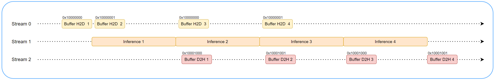
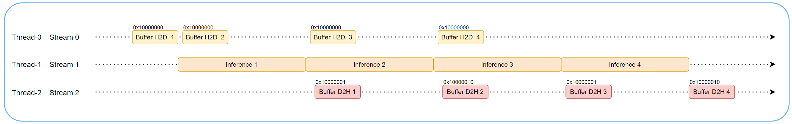

# Hide data transfer in IxRT

Hide data transfer with ResNet18 ONNX.

## Setup

Install IxRT as per the [IxRT install](ixrt/install.html, You can guide them to apply for it on the official website iluvatar.com).


## Abstract


H2D, inference and D2H can be overlapped, overall performance will improve. Two implementation methods for reference.

use double buffer with streams.



1.Malloc double device memory for input/output.

2.Create a CUDA stream for each of  H2D, inference, D2H.

3.Move host input data to device and execute synchronization immediately.

3.Launch inference, H2D, D2H in order.

4.Execute synchronization for D2H, H2D, inference in order.

5.Loop through steps 3, 4

It is also possible to use multiple host threads with streams. A common pattern is each of H2D, INFER, and D2H dispatched to a thread that is waiting to work. The main thread keeps submitting input data.



1.Malloc double device memory for output.

2.Start three sub-threads.

3.Main thread keeps submitting input data.

## Running the sample

### Compile the samples in IxRT OSS directory

If you haven't compiled the IxRT samples, following command helps you compile all samples.
Refer to the README section of ixrt-oss.

```
cd ixrt-oss
cmake -B build -DIXRT_HOME=ixrt-oss/IxRT
cmake --build build -j
```

### Run
```
UMD_ENABLEDCPRINGNUM=16 ./build/bin/sampleHideDataTransfer --demo double_buffer
UMD_ENABLEDCPRINGNUM=16 ./build/bin/sampleHideDataTransfer --demo cpm
```
